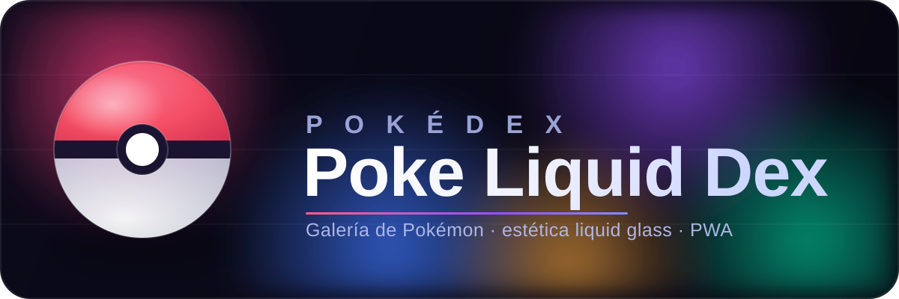

<div align="center">



<br />

<p>
  <b>Poke Liquid Dex</b> — una galería de Pokémon con buscador, filtros, ficha detallada y
  comparador, construida sobre la <a href="https://pokeapi.co" target="_blank">PokeAPI</a>
  con estética <i>liquid glass</i> tipo Apple y pensada para pantallas táctiles.
</p>

<p>
  
  
  
  
  
  
  
</p>

</div>

---

## ✨ Funcionalidades

- 🖼️ **Galería** por generación (I–IX) con carga perezosa de imágenes y tarjetas de vidrio tintadas por tipo.
- 🔎 **Buscador** global (nombre o número) y **filtro por tipo**.
- ❤️ **Favoritos** persistentes y vista «solo favoritos».
- 📇 **Ficha «Completo+»** (en español): descripción, género, altura/peso, habilidades, **estadísticas con barras**, **cadena de evolución navegable**, **shiny**, **cry** (sonido), **formas** y movimientos.
- ⚖️ **Comparador** de hasta 3 Pokémon con **gráfico radar** + tabla lado a lado.
- 🖨️ **Compartir** la ficha como **imagen PNG** (canvas, sin dependencias).
- 🌗 **Tema** automático claro/oscuro (+ conmutador) y **diseño responsivo** (escritorio a dos paneles · móvil con _bottom-sheet_ arrastrable).
- ⚡ **Caché intensiva**: Jotai en memoria + **IndexedDB** (respaldo a `localStorage`) y **PWA** (offline del shell, _artwork_ y respuestas de la API).

## 🎨 Liquid Glass

La interfaz toma prestado el lenguaje visual *liquid glass* de Apple: superficies de vidrio
translúcido con desenfoque, una atmósfera de _blobs_ de gradiente de colores que se filtra a
través de cada panel, y bordes redondeados y suaves. La paleta vive en
[`src/app/styles/app.css`](src/app/styles/app.css) como _tokens_ de tema (claro/oscuro), y los
tintes por tipo en [`src/app/constants/pokedex.constants.ts`](src/app/constants/pokedex.constants.ts).

| Token            | Claro                  | Oscuro                 |
| ---------------- | ---------------------- | ---------------------- |
| Fondo            | `#e7ebf7`              | `#070611`              |
| Vidrio           | `rgba(255,255,255,.55)`| `rgba(255,255,255,.065)`|
| Acento (pokébola)| `#ff5267`              | `#ff5267`              |
| Blobs            | rosa · azul · teal · oro · violeta                |

## 🧱 Arquitectura

- **Atomic design** en `src/app/components/{atoms,molecules,organisms}`; _layouts_ como _templates_ y `src/app/pages` para las páginas.
- **Estado y caché con Jotai** en `src/app/store` (`atomFamily` read-through + `atomWithStorage` para preferencias). Ver [`src/app/store/README.md`](src/app/store/README.md).
- **Datos**: `PokeApiService` (inyectado por IoC) valida con **Zod**, normaliza/recorta y cachea (read-through) usando [`#libs/cache`](src/libs/cache/README.md).
- **Config**: las variables `APP_*` se leen y validan solo en `src/app/app.config.ts` (Zod) y se inyectan por el contenedor IoC.

Librerías internas (cada una con su README): [`#libs/ioc`](src/libs/ioc/README.md) · [`#libs/router`](src/libs/router/README.md) · [`#libs/feature`](src/libs/feature/README.md) · [`#libs/cache`](src/libs/cache/README.md).

## 📥 Inicio

```bash
pnpm install        # instala dependencias
pnpm env:schema     # sincroniza el esquema de entorno
pnpm start          # dev server con HMR
```

1. Instala [Node.js](https://nodejs.org/) (`engines.node`) y [pnpm](https://pnpm.io/installation) (`engines.pnpm`).
2. Ejecuta los comandos de arriba (usa `pnpm test` para los tests).

> El proyecto usa **un único entorno** (`main`); por eso los comandos no llevan sufijo (`pnpm start`, `pnpm build`, `pnpm test`).

### 🐳 Docker

```bash
docker build --no-cache -f Dockerfile --tag poke-liquid-dex .
docker run -d -it -p 8080:8080/tcp --name poke-liquid-dex poke-liquid-dex
```

## 🧪 Scripts

| Comando               | Acción                          |
| --------------------- | ------------------------------- |
| pnpm start            | ejecuta la app (dev server)     |
| pnpm build            | build de producción             |
| pnpm preview          | build + sirve localmente (PWA)  |
| pnpm test             | tests                           |
| pnpm test --coverage  | tests con cobertura             |
| pnpm env:schema       | actualiza el esquema de entorno |
| pnpm lint / stylelint | revisión de código / CSS        |
| pnpm format           | formateo                        |

## 🔧 Variables de entorno (`env/appsettings.json`)

Prefijo `APP_` (expuestas al navegador) salvo `SERVICE_WORKER`/`FONT_*` (build):

| Variable            | Descripción                     | Por defecto                 |
| ------------------- | ------------------------------- | --------------------------- |
| `APP_API_URL`       | Base de la PokeAPI              | `https://pokeapi.co/api/v2` |
| `APP_ARTWORK_URL`   | Base del artwork oficial        | CDN de PokeAPI sprites      |
| `APP_SPRITE_URL`    | Base de sprites (fallback)      | CDN de PokeAPI sprites      |
| `APP_CRIES_URL`     | Base de los _cries_             | CDN de PokeAPI cries        |
| `APP_MAX_DEX`       | Último id de la Pokédex         | `1025`                      |
| `APP_CACHE_VERSION` | Versión de la caché (namespace) | `v1`                        |
| `SERVICE_WORKER`    | Activa la PWA en el build       | `true`                      |

## 📚 Documentación

| Tema                                  | Dónde                                              |
| ------------------------------------- | -------------------------------------------------- |
| Contrato del proyecto (stack, reglas) | [`AGENTS.md`](AGENTS.md)                           |
| Arquitectura, estándares y patrones   | [`.github/instructions/`](.github/instructions/)   |
| Scaffolds de código                   | [`.vscode/__templates__/`](.vscode/__templates__/) |
| Librerías internas                    | [`src/libs/`](src/libs/)                           |
| Logo y recursos de marca              | [`docs/`](docs/)                                   |

<div align="center">
<br />
<sub>Hecho con ⚛️ React + 🧪 Vite · datos de <a href="https://pokeapi.co">PokeAPI</a> · estética <i>liquid glass</i> · <b>MIT</b></sub>
</div>
